# 🚆 RAILSYNC-AI
### **AI-Powered Automatic Block Planning to Maximize Asset Availability for Train Operations on Indian Railways**

[](https://www.sih.gov.in/)
[](https://indianrailways.gov.in/)
[](#-project-status--current-stage)

---

## 📌 Problem Statement Metadata
* **Problem Statement ID:** `SIH26027`
* **Organization:** Ministry of Railways
* **Department:** Ministry of Railways
* **Category:** Software
* **Theme:** Transportation & Logistics
* **Tagline:** *"One Corridor. One Coordinated Block. Zero Compromise on Safety & Punctuality."*

---

## 📍 Project Status & Current Stage

```
[✅] STEP 1: Problem Selection & Domain Research (SIH26027 Finalized)
[✅] STEP 2: CAG Audit, RDSO & CRIS Ground Data Analysis Completed
[✅] STEP 3: Mathematical Optimization Formulation (OR-Tools CP-SAT Designed)
[✅] STEP 4: High-Fidelity UI Prototype & Time-Distance Marey Mockup Generated
[✅] STEP 5: Official 6-Slide Pitch Deck & Designer Handover Pack Ready
[🔄] STEP 6: 3-Day Hackathon Prototype Implementation (IN PROGRESS)
```

---

## 🎯 Executive Overview

Infrastructure maintenance on Indian Railways is currently planned independently by three siloed departments:
* **Civil / Track Engineering (TMS):** Rail defects, USFD flaws (IMR/OBS), Track Tamping (CSM/BCM).
* **Electrical / Traction (TDMS):** 25 kV Overhead Equipment (OHE) wire maintenance & isolations.
* **Signal & Telecom (SMMS):** Electronic Interlocking (EI), point machines, track circuits.

Because these departments submit uncoordinated block requests into **BDMS**, Section Controllers frequently curtail or deny maintenance to protect **Train Punctuality % (COA/WTT)**. This creates a severe backlog of overdue safety defects and leaves expensive track machines idle **~45% of the time** (as highlighted in **CAG Audit Report No. 22**).

### **The RAILSYNC-AI Solution:**
RAILSYNC-AI is an **Explainable AI and Constraint-Optimization Decision Support Cockpit** that bundles cross-departmental maintenance into unified **Integrated Shadow Blocks** during low-density traffic windows, achieving:
* **+48% increase** in productive block hours.
* **0-minute delay** for high-priority passenger services (*Rajdhani / Vande Bharat*).
* **Sub-second dynamic re-planning** when emergency track defects or freight delays occur.

---

## 🏛️ System Architecture

```mermaid
flowchart LR
    subgraph Ingestion ["1. Data Ingestion Layer"]
        TMS["TMS<br/>(Track Defects)"]
        SMMS["SMMS<br/>(Signal Faults)"]
        TDMS["TDMS<br/>(OHE Isolations)"]
        COA["COA / WTT<br/>(Train Timetables)"]
        FOIS["FOIS<br/>(Goods Forecasts)"]
    end

    subgraph CoreEngine ["2. Optimization Engine"]
        Scorer["Asset Criticality Scorer<br/>(IMR/OBS + Days Overdue + GMT)"]
        Bundler["Spatial-Temporal Bundler<br/>(25 kV Safety Isolation Rules)"]
        Solver["Google OR-Tools CP-SAT Solver<br/>(Multi-Objective Mathematical Model)"]
    end

    subgraph Interface ["3. Controller Cockpit"]
        Marey["Time-Distance Marey Chart"]
        Gantt["Synchronized Gantt Lanes"]
        RePlan["Emergency Disruption Resolver"]
    end

    Ingestion --> Scorer --> Bundler --> Solver --> Interface
```



---

## 🛠️ Technology Stack

| Layer | Technologies |
| :--- | :--- |
| **Frontend UI** | React 18, TypeScript, Tailwind CSS, Shadcn UI, Lucide Icons |
| **Data Visualization** | D3.js & Plotly (Railway Time-Distance Marey Diagram & Gantt Lanes) |
| **Backend API** | Python 3.11, FastAPI (Asynchronous REST + WebSockets) |
| **Optimization Core** | Google OR-Tools (`cp_model`), NetworkX Graph Library, LightGBM |
| **Database & GIS** | PostgreSQL + PostGIS (Spatial Track Coordinate Modeling) |

---

## 📂 Repository & Presentation Assets

All pitch materials, slide copy, and design assets are organized inside [`sih_presentation_pack/`](./sih_presentation_pack/):

```text
sih_rail/
├── sih_presentation_pack/
│   ├── dashboard_ui_mockup.jpg          <-- High-resolution UI prototype for PPT slides
│   ├── ppt_designer_handover_pack.pdf    <-- Color palettes, wireframes, copy & chart data
│   ├── sih_pitch_deck_presentation.pdf   <-- Official 6-slide SIH pitch deck copy
│   ├── railsync_pitch_deck_master_doc.pdf<-- Master doc with Midjourney prompts & datasets
│   └── ui_prototype.pdf                  <-- UI breakdown & Marey chart documentation
└── README.pdf                            <-- This project master documentation
```

---

## ⏱️ 3-Day Hackathon Sprint Roadmap

* **Day 1 (Foundation):** Division dataset synthesis (8 stations, 25 trains, 15 defects across TMS/SMMS/TDMS) + Asset Criticality Scoring API.
* **Day 2 (Core Solver):** Google OR-Tools CP-SAT Multi-Objective Block Scheduler + D3.js Marey String Chart UI.
* **Day 3 (Showstopper Demo):** Live "Emergency Disruption Injection" module (sub-second re-scheduling) + Final Pitch Walkthrough.
